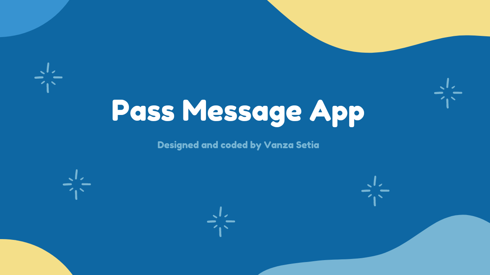
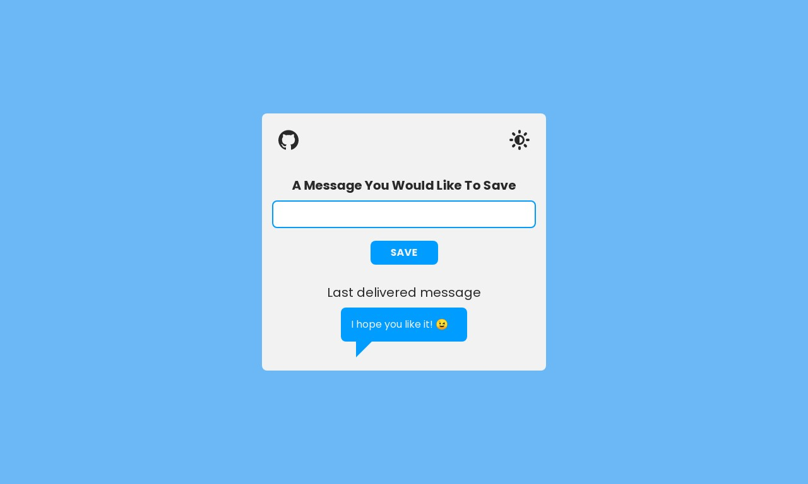
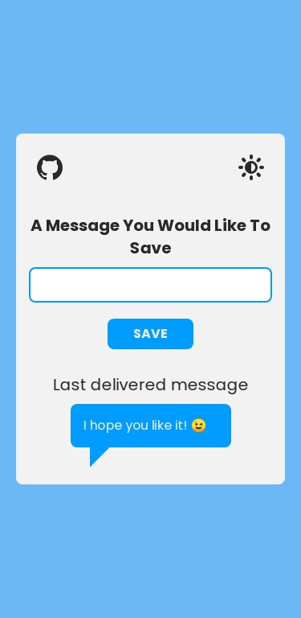

<!-- Banner -->

<!-- ENDOF Banner-->

<!-- Badges -->
<p align="left">
  
  <a href="https://twitter.com/vanzasetia" target="_blank"></a>
  
  
  
</p>
<!-- ENDOF Badges -->

<!-- CSS Validation Status -->
<p>
  <a href="http://jigsaw.w3.org/css-validator/check/referer">
    
    </a>
  <a href="https://github.com/standard/semistandard">
    
    </a>
</p>
<!-- ENDOF CSS Validation Status -->

<!-- Title -->
# Pass Message App
<!-- Title -->

<!-- Table Of Contents -->
## Table of contents
- [Overview](#overview)
  - [Introduction](#introduction)
  - [The challenge](#the-challenge)
  - [Links](#links)
  - [Screenshots](#screenshots)
- [My process](#my-process)
  - [Built with](#built-with)
  - [What I learned](#what-i-learned)
    - [JavaScript Regular Expression](#javascript-regular-expression)
  - [Useful resources](#useful-resources)
  - [Continued development](#continued-development)
- [How to contribute](#how-to-contribute)
  - [Practice](#practice)
  - [Prerequisite](#prerequisite)
  - [Setup](#setup)
- [Author](#author)
- [Acknowledgements](#acknowledgements)
- [License](#license)
- [References](#references)
<!-- ENDOF Table Of Contents -->

<!-- Overview -->
## Overview
[(Back to top)](#table-of-contents)

### Introduction
This a simple JavaScript app that I created to sharpen my JavaScript skill. Feel free to give me any feedback by <a href="mailto: venusbumi2@gmail.com">email</a> or DM me on Twitter 😉.

### The Challenge
The user should be able to:
* Pass the message
* See the message that has been passed
* See their last massage across closing browser and refresh
* See the theme based on their preference
* Change the theme
* Not passing an empty message
* Use this app using assistive technology (keyboard, screen reader)

### Links
- [🌐 Live Review](https://vanzapassmessage.netlify.app/)

### Screenshots

Desktop


Mobile


<!-- ENDOF Overview -->

<!-- My Process -->
## My Process
[(Back to top)](#table-of-contents)

### Built With
- HTML Semantic Tags
- [Sass](https://sass-lang.com/)
- Flexbox
- Mobile-first workflow
- [Normalize.css](https://necolas.github.io/normalize.css/)
- [Eruda - mobile console browser](https://github.com/liriliri/eruda)
- And many [NPM packages](#prerequisite) 😂

### What I Learned

### JavaScript Regular Expression
This is an unexpected thing, where I will learn Regexp (Regular Expression) when working on this app. I need to use regular expression to prevent the user pass any white space characters (space, tab) only.

The regex code that I used was:
```javascript
const regex = /\S/g;
```

That code will check any non-whitespace characters. If there's any non-whitespace characters, the user will be allowed to pass the message, regardless how many characters that the user passing in.

### Useful Resources
- [JavaScript Best Practices](https://www.w3.org/wiki/JavaScript_best_practices) - This is a good article that will tell you how to write a strong JavaScript code.
- [Regex Tester](https://regex101.com) - This tool allow me to test my regular expression before I used it in my production code.

### Continued Development
Maybe after some time, I will refactor this code or I'm just gonna improve this solution.
<!-- ENDOF My Process -->

<!-- How To Contribute -->
## How To Contribute
[(Back to top)](#table-of-contents)

### Practice
If this the first time, you are starting to contribute to an open source, it might be confusing to follow along. I recommend to check this article about [make your first open-source contribution by Marco Denic](https://community.codenewbie.org/denicmarko/make-your-first-open-source-contribution-19k2). After that, you can come back and follow along.

### Prerequisite
- If you find bug, tpo, issue, grammar error, or anything that can be improved, then continue. If not, well just [skip to the next section](#author).
- You need to have [Node.js](https://nodejs.org/en/) installed on your machine. To check that you have Node.js, try to run this command on your terminal:
```shell
node --version
```
- You need all these packages **installed globally** to run all the scripts on `package.json`.
  - [Browsersync](https://browsersync.io/) for the development server.
  - [Sass](https://www.npmjs.com/package/sass) to compile Sass code into CSS.
  - [npm-run-all](https://www.npmjs.com/package/npm-run-all) to run the `devserver` and the `watch:sass` script simultaneously. Also, for the `build` script.
  - [Postcss](https://www.npmjs.com/package/postcss) to run autoprefixer.
  - [Autoprefixer](https://www.npmjs.com/package/autoprefixer) to add vendor prefixes if needed.
  - [Prettier](https://www.npmjs.com/package/prettier) to format the HTML code.
  - [csscomb](https://www.npmjs.com/package/csscomb) to format and sort the properties order the Sass and CSS files.
  - [semistandard](https://github.com/standard/semistandard) to format JavaScript code
  - [markserv](https://www.npmjs.com/package/markserv) live server for the markdown file.

### Setup
- First, fork this repo.
- Clone this repo to your local machine with HTTPS or SSH.
- Navigate to this project folder using your favorite terminal.
- Add the project repository as the "upstream" remote.
  - In your project repository, click the download button and then copy the HTTPS URL.
  - Then type this and paste the URL.
```shell
git remote add upstream <url>
```
  - Use git `remote -v` to check that you now have two remotes.
- To make sure that you have the lastest version of the project repository, run this command.
```shell
git pull 
```
- Create a new branch, by execute this command. You can change the branch name based on what are you going to do, for this example I call it, `fixingbugs`.
```shell
git checkout -b fixingbugs
```
- Now, you can start editing the files. Run `npm start` for the development environment. `localhost:8080` for web development and `localhost:8642` for `README.md`.
- After you have finished editing, simply run `npm run build`.
- Add all files to staging area.
```shell
git add .
```
- Then, you can commit your changes.
```shell
git commit -m "Fixed bugs"
```
- Push your changes.
```shell
git push -u origin fixingbugs
```
- After that you can see the `Compare and Pull Request` button and follow the instructions.
- Now, you can relax and wait for your pull request to be accepted.
<!-- ENDOF How To Contribute -->

<!-- Author -->
## Author
[(Back to top)](#table-of-contents)

I upload about coding on this platform.
- Frontend Mentor - [@vanzasetia](https://www.frontendmentor.io/profile/vanzasetia)
- Twitter - [@vanzasetia](https://www.twitter.com/vanzasetia)
- Code Newbie - [@vanzasetia](https://community.codenewbie.org/vanzasetia)
- Facebook - [Vanza Setia](https://www.facebook.com/profile.php?id=100071874075732)
- Instagram - [@vanzapsetia](https://www.instagram.com/vanzapsetia/)
<!-- ENDOF Author -->

<!-- Acknowledgements -->
## Acknowledgements
[(Back to top)](#table-of-contents)

Thank you for everyone who has read till this point. You are amazing 👍.
<!-- END OF Acknowledgements -->

<!-- LICENSE -->
## License
[(Back to top)](#table-of-contents)

> You can check out [the full license](https://github.com/vanzasetia/
pass-message-app/blob/master/LICENSE)

This project is licensed under the terms of the MIT license.

For those of you who are wondering, why do I need to license this? 
- Well, first it's free 😁.
- Second I checked this [Choose license website](https://choosealicense.com/) to help me chose a license.
- The last reason, if I don't want to choose a license, then [here's what gonna happen](https://choosealicense.com/no-permission/).
<!-- ENDOF LICENSE -->

## References

> See the [documentation](https://github.com/vanzasetia/pass-message-app/tree/master/doc)